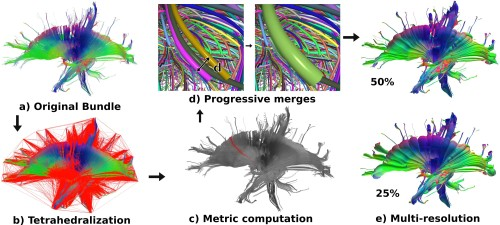

# Neural-Meta-Tracts - Fiber Reductor
<p align="center"></p>

## Overview
This software creates a multi-resolution from a tractogram and allows for the use of a fuzzy grid for interactive segmentation. It can take as input either tck or vtk files for the fibers and vtk files for the cortical surface. Fuzzy grids are in text format. This is the C++ reference implementation for the papers: 

>**[Progressive and Efficient Multi-Resolution Representations for Brain Tractograms](https://hal.archives-ouvertes.fr/hal-01865128/document)** *Corentin Mercier, Pietro Gori, Damien Rohmer, Marie-Paule Cani, Tamy Boubekeur, Jean-Marc Thiery and Isabelle Bloch.* Eurographics Workshop on Visual Computing for Biology and Medicine (EG VCBM), Sep 2018, Granada, Spain. 2018. DOI: [https://doi.org/10.2312/vcbm.20181232](https://doi.org/10.2312/vcbm.20181232)

>**[White Matter Multi-resolution Segmentation using Fuzzy Theory](https://hal.archives-ouvertes.fr/hal-01983010/document)** *Corentin Mercier, Alessandro Delmonte, Johan Pallud, Isabelle Bloch and Pietro Gori.* ISBI 2019 - IEEE International Symposium on
Biomedical Imaging, Apr 2019, Venice, Italy.

This is not the exact same version of the source code that is used to measure performance for the corresponding papers. Performance might have been slightly affected during refactoring.

Copyright(C) 2019 Corentin Mercier, Alessandro Delmonte, Pietro Gori, Damien Rohmer, Marie-Paule Cani, Tamy Boubekeur, Jean-Marc Thiery and Isabelle Bloch

All right reserved

## Release Notes ##
### v1.0 ###
Initial version

## Dependences

This software requires some external librries to run, which are:
* git
* cmake (version > 3.9)
* g++
* qt4
* glew
* openmp

To install everything on ubuntu, use the following command line:
```
sudo apt install git cmake g++ qt4-default libglew-dev libomp-dev
```

## Building and Running

This program uses CMake. It has been tested on Linux using Ubuntu 18.04 (LTS) with gcc 7.3 and Ubuntu 16.04 (LTS) with gcc 5.4. Building on Windows 10 or MacOS has not been tested. Direct compatibility with visual c++ is not ensured as their version of OpenMP (that we used to parallelize our code) is too old. The easiest way to get a working version *under* windows is to use WSL. 

To obtain the code with the submodules, use:
```
git clone --recurse-submodules https://github.com/CorentinMercier/neural-meta-tracts.git
cd neural-meta-tracts
```
To build the source code with VTK, you can use the following commands:
```
mkdir build
cd build
cmake -DCMAKE_BUILD_TYPE=Release -DVTK_DIR=/path/to/vtk/build ..
make -j8
```

To build the source code without VTK, you can use the following commands: 

```
mkdir build
cd build
cmake -DCMAKE_BUILD_TYPE=Release ..
make -j8
```

Then, you can simply lauch the code using the following command line:

```
./fiberreductor
```

The prompt windows will ask you for the different input files. Only the first one is mandatory, others can be ignored by pressing the cancel button.

## Citation

Please cite the following paper in case you are using this code:
>**[Progressive and Efficient Multi-Resolution Representations for Brain Tractograms](https://hal.archives-ouvertes.fr/hal-01865128/document)** *Corentin Mercier, Pietro Gori, Damien Rohmer, Marie-Paule Cani, Tamy Boubekeur, Jean-Marc Thiery and Isabelle Bloch.* Eurographics Workshop on Visual Computing for Biology and Medicine (EG VCBM), Sep 2018, Granada, Spain. 2018. DOI: [https://doi.org/10.2312/vcbm.20181232](https://doi.org/10.2312/vcbm.20181232)

If you use the segmentation part, please cite the following paper:
>**[White Matter Multi-resolution Segmentation using Fuzzy Theory](https://hal.archives-ouvertes.fr/hal-01983010/document)** *Corentin Mercier, Alessandro Delmonte, Johan Pallud, Isabelle Bloch and Pietro Gori.* ISBI 2019 - IEEE International Symposium on
Biomedical Imaging, Apr 2019, Venice, Italy.

## Authors

* [**Corentin Mercier**](https://perso.telecom-paristech.fr/comercier/)
* [**Alessandro Delmonte**](https://aledelmo.github.io)
* [**Pietro Gori**](https://perso.telecom-paristech.fr/pgori/)
* [**Damien Rohmer**](https://imagecomputing.net/damien.rohmer/)
* [**Marie-Paule Cani**](https://team.inria.fr/imagine/marie-paule-cani/)
* [**Tamy Boubekeur**](https://perso.telecom-paristech.fr/boubek)
* [**Jean-Marc Thiery**](https://perso.telecom-paristech.fr/jthiery/)
* [**Isabelle Bloch**](https://perso.telecom-paristech.fr/bloch/)

## License

This project is licensed under the MIT license - see the [LICENSE](LICENSE) file for details.
